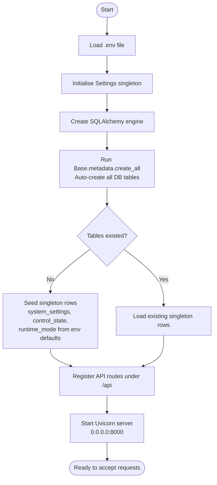
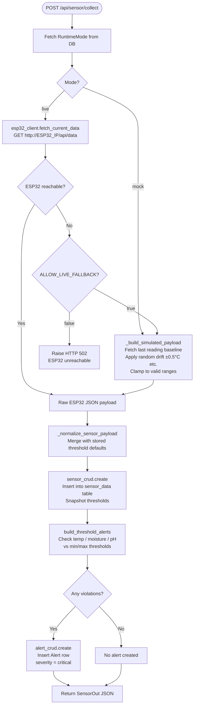
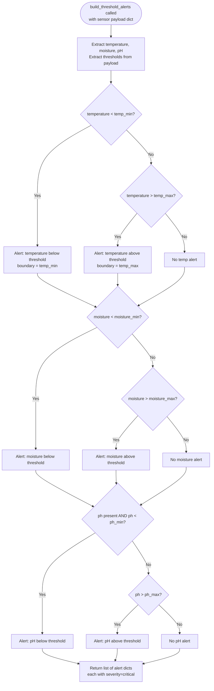
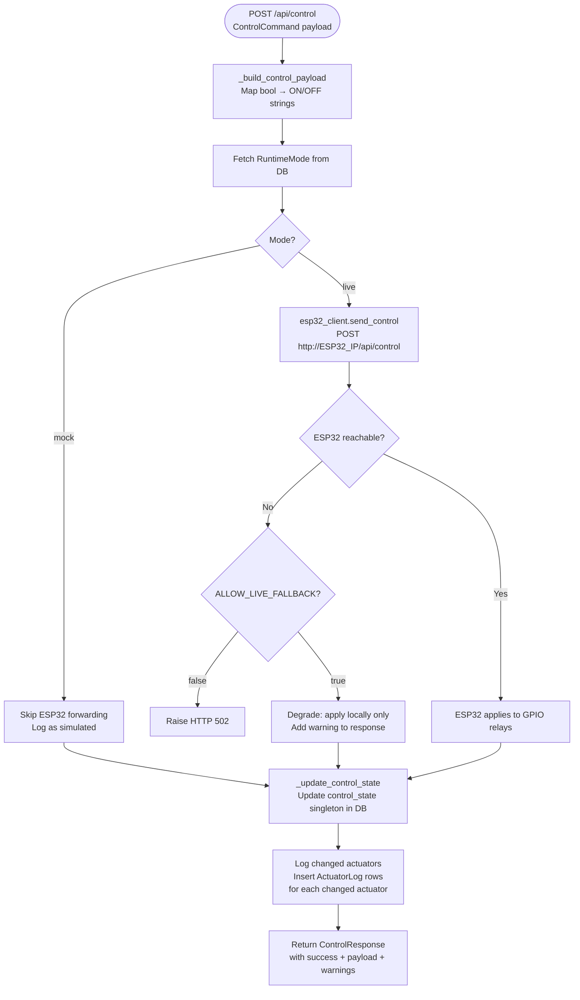
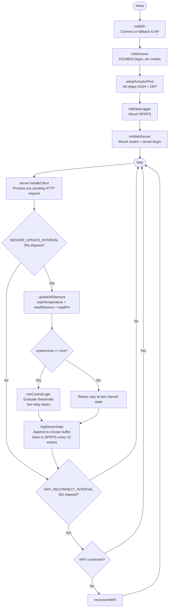
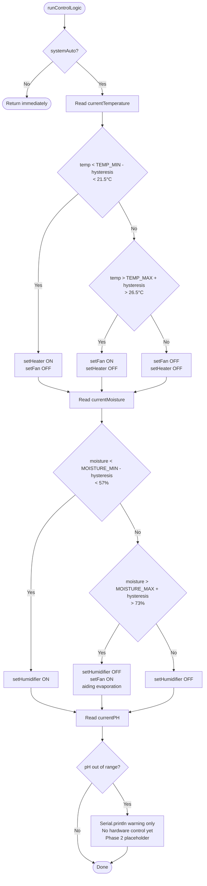
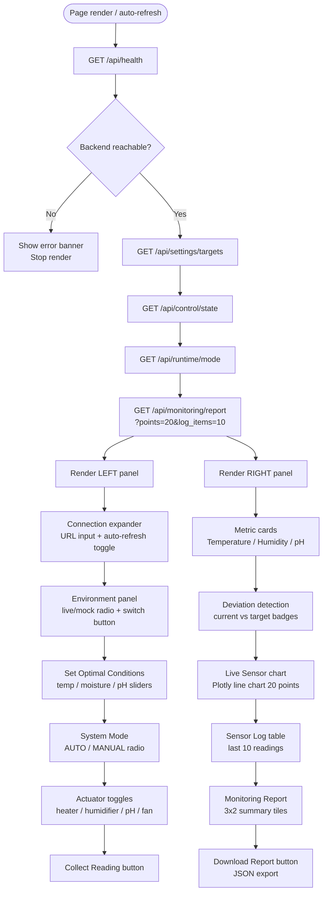
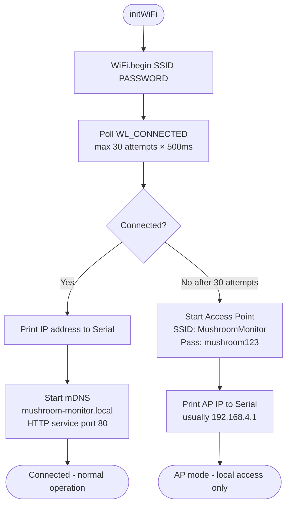
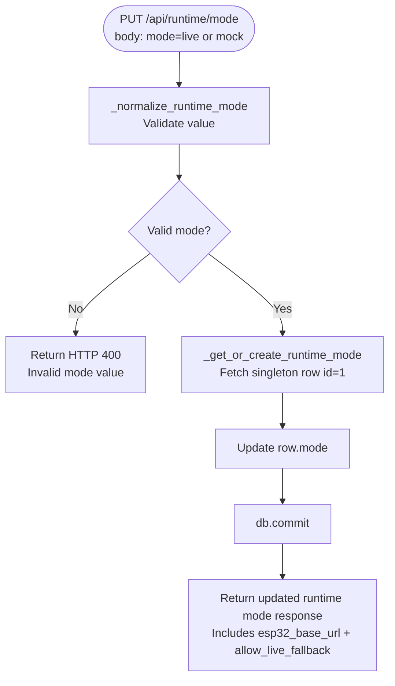
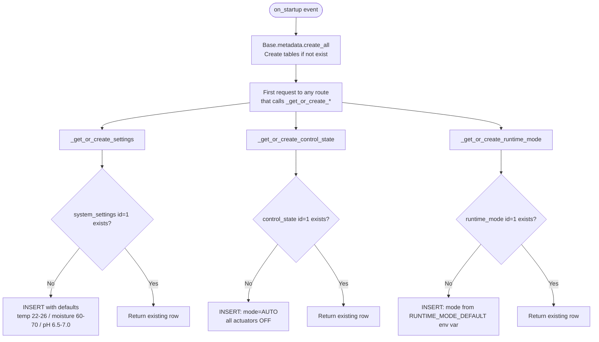

# Flowcharts

All diagrams use [Mermaid](https://mermaid.js.org/) syntax, rendered natively in GitHub, GitLab, and most markdown viewers.

---

## 1. System Startup Flow

---

## 2. Sensor Data Collection Flow

---

## 3. Alert Engine Flow

---

## 4. Actuator Control Flow

---

## 5. ESP32 Firmware Main Loop

---

## 6. ESP32 Auto-Control Logic

---

## 7. Dashboard Render Flow

---

## 8. WiFi Manager Flow (ESP32 Startup)

---

## 9. Runtime Mode Switch Flow

---

## 10. Backend Startup Singleton Seeding

