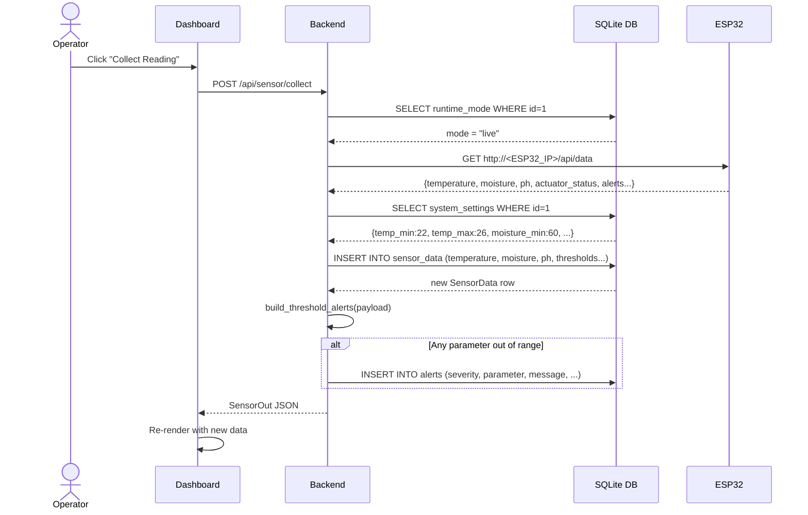
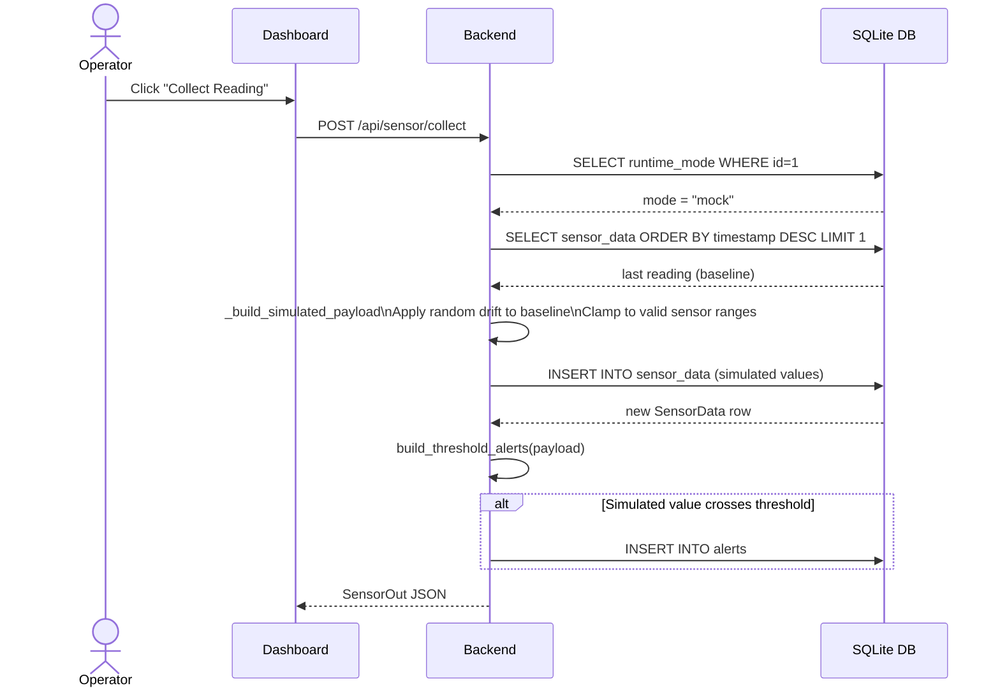
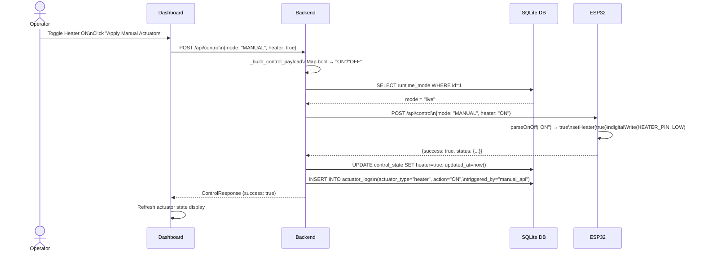
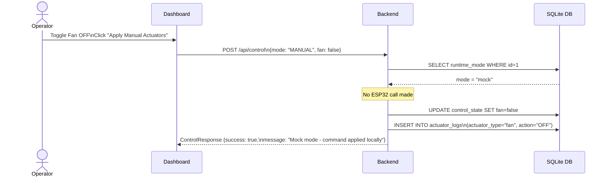
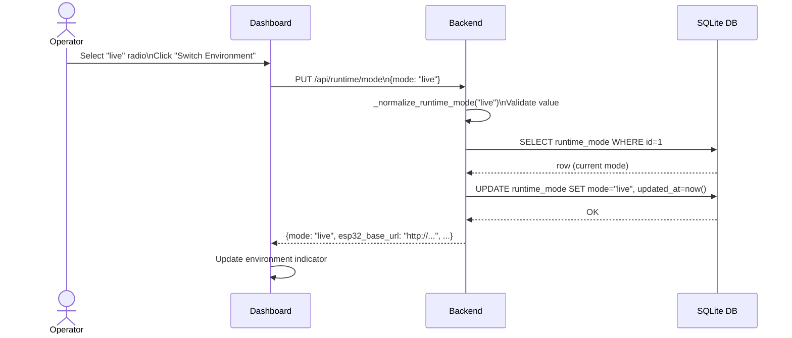
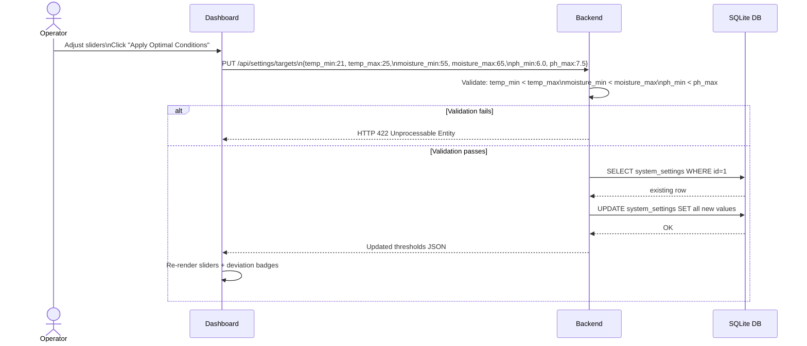
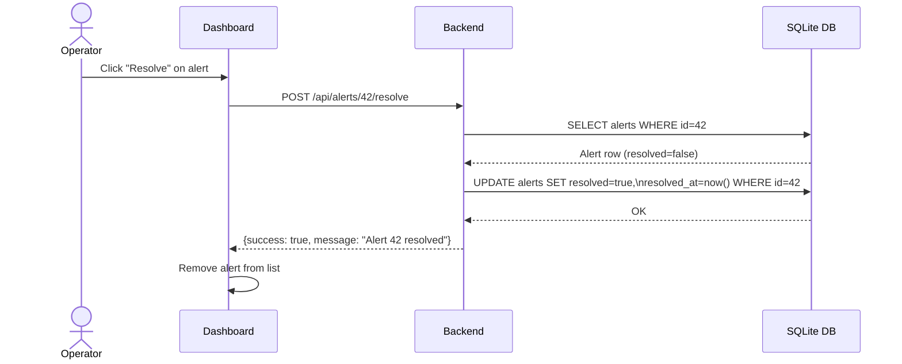
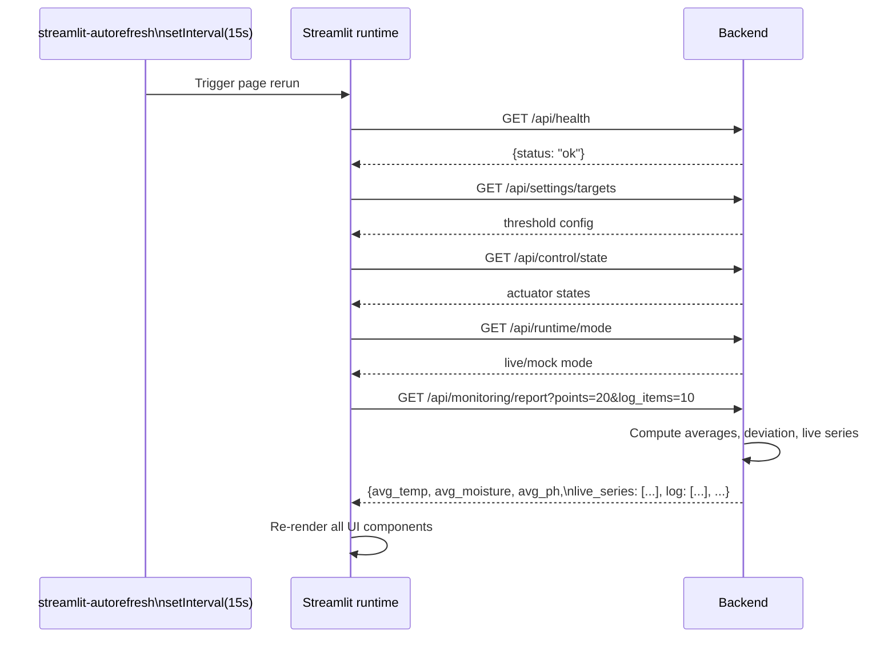
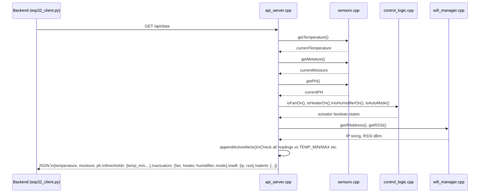
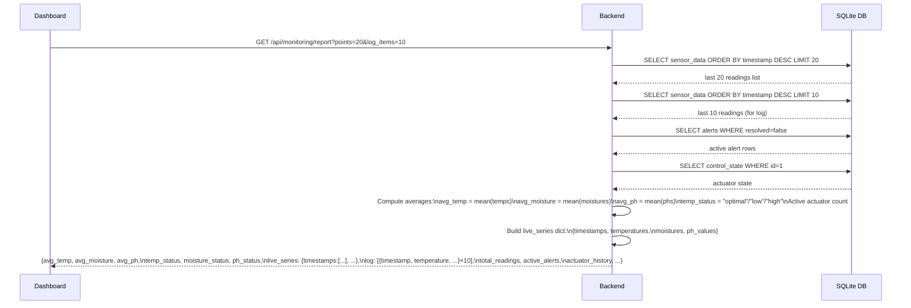

# Sequence Diagrams

All diagrams use [Mermaid](https://mermaid.js.org/) sequence diagram syntax.

---

## 1. Collect Sensor Reading (Live Mode)



---

## 2. Collect Sensor Reading (Mock Mode)



---

## 3. Send Actuator Command (Live Mode, Manual)



---

## 4. Send Actuator Command (Mock Mode)



---

## 5. Switch Runtime Environment



---

## 6. Update Threshold Targets



---

## 7. Resolve Alert



---

## 8. ESP32 Sensor Read Cycle (Internal, every 30s)

```mermaid
sequenceDiagram
    participant Loop as main.cpp loop()
    participant Sensors as sensors.cpp
    participant Control as control_logic.cpp
    participant Logger as data_logger.cpp
    participant HW as Hardware (GPIO/ADC)

    Loop->>Loop: Check SENSOR_UPDATE_INTERVAL elapsed
    Loop->>Sensors: updateAllSensors()
    Sensors->>HW: tempSensors.requestTemperatures()
    HW-->>Sensors: DS18B20 raw value
    Sensors->>Sensors: Apply EMA: 0.7*old + 0.3*new
    Sensors->>HW: analogRead(MOISTURE_SENSOR_PIN)\n× 5 samples averaged
    HW-->>Sensors: raw ADC moisture value
    Sensors->>Sensors: calculateMoisturePercentage\nmap(raw, AIR, WATER, 100, 0)
    Sensors->>HW: analogRead(PH_SENSOR_PIN)
    HW-->>Sensors: raw ADC pH value
    Sensors->>Sensors: pH = 14.0 - (voltage × 3.5)
    Sensors-->>Loop: updated global currentTemperature/Moisture/PH

    alt systemAuto == true
        Loop->>Control: runControlLogic()
        Control->>Sensors: getTemperature(), getMoisture(), getPH()
        Sensors-->>Control: current readings
        Control->>HW: digitalWrite(HEATER_PIN / FAN_PIN / HUMIDIFIER_PIN)
        Control-->>Loop: actuator states updated
    end

    Loop->>Logger: logSensorData()
    Logger->>Logger: Append to circular buffer[bufferIndex]
    Logger->>Logger: bufferIndex++ (wraps at MAX_LOG_ENTRIES)
    alt entryCount % 10 == 0
        Logger->>Logger: saveDataToFile()\nSerialise buffer to /sensor_data.json on SPIFFS
    end
```

---

## 9. Dashboard Auto-Refresh Cycle



---

## 10. ESP32 HTTP Request Handling (GET /api/data)



---

## 11. Monitoring Report Generation


